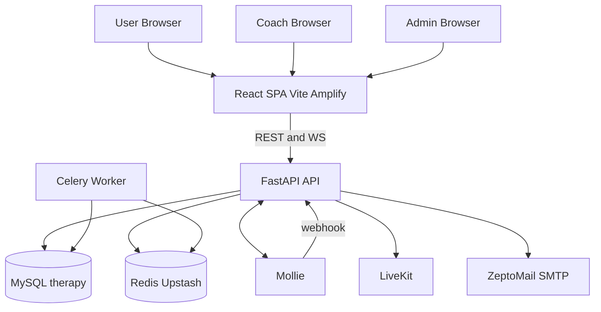
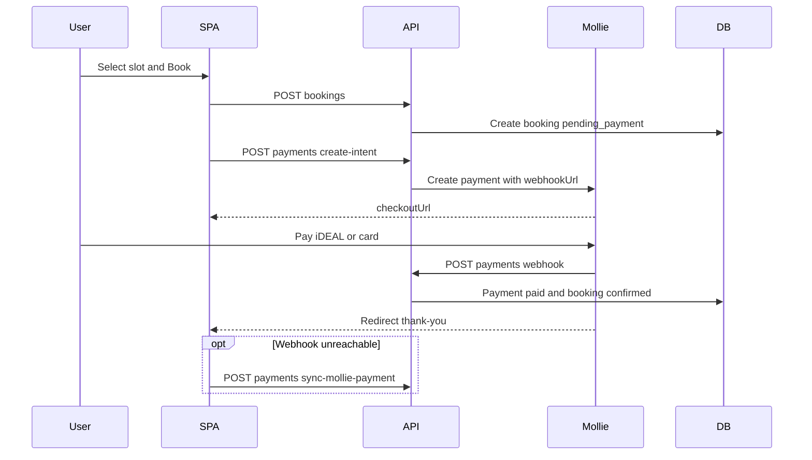
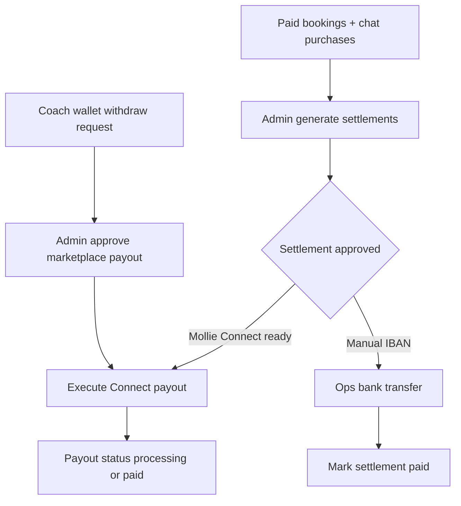

# Mijn Levenspad — End-to-End Project Report

**Product:** Spiritual coaching marketplace (booking, metered chat, LiveKit, Mollie payouts)  
**Stack:** React (Vite) + FastAPI + MySQL + Redis/Celery + Mollie + LiveKit  
**Report type:** Application overview · Problems faced · Solutions · Prevention  
**Related docs:** `TECHNICAL_ARCHITECTURE.md` · `technical-architecture.html`  
**Version:** 1.0

---

## Table of contents

1. [Executive summary](#1-executive-summary)
2. [Application overview](#2-application-overview)
3. [End-to-end flows](#3-end-to-end-flows)
4. [Features delivered in this workstream](#4-features-delivered-in-this-workstream)
5. [Problems, solutions, and prevention](#5-problems-solutions-and-prevention)
6. [Open risks](#6-open-risks)
7. [Definition of done — payments](#7-definition-of-done--payments)
8. [Preventive operating model](#8-preventive-operating-model)
9. [Document map](#9-document-map)
10. [Closing](#10-closing)

---

## 1. Executive summary

Mijn Levenspad is a multi-sided coaching platform:

| Role | Primary jobs |
|------|----------------|
| **User** | Discover coaches, book sessions, pay via Mollie, metered chat, wallet, reviews |
| **Coach** | Register (KVK + bank), set availability, deliver sessions, earn 70% of metered chat, request payouts |
| **Admin** | Approve coaches, KPIs/analytics, settlements, marketplace payouts, support ops |

**Revenue split (metered chat):** coach **70%** / platform **30%**.

This report covers how the system works end-to-end, what broke during build and operations, what we fixed, and how to avoid the same problems later.

---

## 2. Application overview

### 2.1 Architecture at a glance

### 2.2 Technology stack

| Layer | Choice |
|-------|--------|
| Frontend | React + TypeScript + Vite + Tailwind + TanStack Query |
| Backend | FastAPI + SQLAlchemy + Pydantic |
| Auth | JWT access + httpOnly refresh cookies (user / mentor / admin) |
| Database | MySQL (`therapy`) |
| Queue | Redis / Upstash + Celery |
| Payments | Mollie (checkout + Connect) + manual IBAN path |
| Realtime | WebSocket chat hub + LiveKit WebRTC |
| Email | ZeptoMail SMTP |
| Media | Cloudinary (or local `/uploads`) |

### 2.3 Major domains

| Domain | Responsibility |
|--------|----------------|
| Auth & OTP | Register, login, refresh, email verification |
| Booking | Slots, bookings, reschedule, waitlist |
| Payments | Mollie intent, webhook, sync, promos, FX |
| Chat | Metered minutes, messages, invoices |
| Meetings | LiveKit tokens / optional SIP |
| Marketplace | Ledger wallets, Connect, coach payout requests |
| Settlements | Cycle aggregation, approve, pay / mark paid |
| Admin | KPIs, filters, ops console |
| Support | Public contact + user/coach support forms |

---

## 3. End-to-end flows

### 3.1 User happy path

1. Register / verify email (OTP)  
2. Browse coaches → pick slot → book  
3. Pay via Mollie (`POST /payments/create-intent`)  
4. Webhook (or SPA `sync-mollie-payment`) marks booking paid  
5. Optional: start/extend metered chat → Mollie → WebSocket messages  
6. Optional: LiveKit video/call  
7. After completion → review  

### 3.2 Coach happy path

1. Register with KVK + **IBAN** (payout account created at signup)  
2. Email verify → admin approval → `active`  
3. Set availability / presence  
4. Deliver sessions / chat  
5. Earnings → settlement / marketplace wallet  
6. Payout via **manual bank transfer** and/or **Mollie Connect**  

### 3.3 Admin happy path

1. Approve coaches / applications  
2. Monitor KPIs (overview + analytics with filters)  
3. Generate settlements → approve → pay / mark paid  
4. Marketplace payout approve/execute  
5. Announcements, presence, invoices, wallet ops  

---

## 4. Features delivered in this workstream

| Area | What was added or changed |
|------|---------------------------|
| Coach registration | Required bank details (holder, IBAN, optional BIC) |
| Admin dashboard | KPI sections + coach/user/date filters (DB dropdowns) |
| Support | Public `/contact`, user + coach support pages |
| Availability | Coach windows + user popup when offline/busy |
| Admin messaging | All coaches or one coach + optional email |
| Architecture pack | Technical architecture MD + print HTML |
| Ops hardening | Startup DB resilience; payment readiness checklist |
| Docs cleanup | Dump artifacts ignored; DB source-of-truth clarified |

---

## 5. Problems, solutions, and prevention

### Problem 1 — MySQL startup / lost connection during schema bootstrap

**Symptom:** API startup failed or hung on long DDL (`ensure_marketplace_ledger_tables`); MySQL `2013 Lost connection`.

**Root cause:** Large batch DDL against remote MySQL; transient disconnects / lock waits aborted boot.

**Solution applied:**
- Per-DDL execution with retries in `startup_schema.py`
- Soft-fail transient DB errors in `main.py` `_run_startup_step` so the API can still start

**Future measures:**
- Prefer Alembic migrations over heavy runtime DDL
- Health-check DB before long schema steps
- Separate migrate job from web process in production
- Alert on startup soft-fails (do not silently skip forever)

---

### Problem 2 — SMTP / OTP email failures (ZeptoMail)

**Symptom:** OTP / registration email failed (`535 Authentication Failed`).

**Root cause:** Invalid or revoked SMTP API token; From must be a verified sender.

**Solution applied:**
- Diagnosed ZeptoMail auth failure
- Documented correct SMTP env (`emailapikey` + API token + verified From)
- Dev fallback: OTP returned/logged when SMTP host empty

**Future measures:**
- Secrets rotation calendar; never commit `.env`
- Staging SMTP smoke test in deploy checklist
- Monitor bounce / auth failures for transactional email

---

### Problem 3 — Payment webhooks unreachable (`innerfixintix.in` DNS)

**Symptom:** Mollie cannot notify API after payment. Configured webhook host does not resolve (DNS NXDOMAIN). SPA hosts do not proxy `/api`.

**Root cause:** API hostname in env is dead; Amplify / static frontend cannot receive Mollie webhooks.

**Solution applied:**
- Live checklist against running backend
- Confirmed Mollie live key works, but webhook host is unreachable
- Documented target topology: SPA → public API ← Mollie webhooks
- Client fallback: `POST /payments/sync-mollie-payment`

**Future measures:**

| Measure | Detail |
|---------|--------|
| Stable API DNS | e.g. `api.mijnlevenspad.com` with TLS + nginx |
| Env split | `MOLLIE_WEBHOOK_BASE_URL` = API; `MOLLIE_REDIRECT_BASE_URL` = SPA |
| Deploy gate | Pricing + webhook URL must resolve before go-live |
| No live Mollie on localhost | without tunnel + test key |

**Status:** Still an **open production blocker** until DNS/API host is fixed.

---

### Problem 4 — Local development using Mollie live keys

**Symptom:** Local `ENVIRONMENT=development` with `live_` Mollie key → real charges + broken webhooks.

**Root cause:** Same `.env` used for production-like credentials on a laptop.

**Solution applied:**
- Identified live key mode in checklist
- Recommended `test_` keys locally; empty webhook base or ngrok for local webhook tests

**Future measures:**
- Separate `.env.development` / `.env.production`
- Guardrail: warn or refuse `live_` keys when host is localhost
- Only production server holds live secrets (vault / CI secrets)

---

### Problem 5 — Celery / Upstash Redis outbox overflow

**Symptom:** Logs show `max single record size exceeded` for marketplace outbox / reconcile; async jobs stuck.

**Root cause:** Oversized Celery/outbox payload in Upstash Redis; worker cycle unhealthy.

**Solution applied:**
- Flagged as ops blocker in payment checklist
- Recommended flush/trim Redis key or new DB + run Celery worker

**Future measures:**
- Cap outbox payload size; store large blobs in DB, queue only IDs
- Redis memory monitoring + alerts
- Always run Celery worker in production
- Periodic outbox cleanup job

---

### Problem 6 — Coach payout readiness incomplete

**Symptom:** Active coaches missing IBAN; most Mollie Connect accounts not `payouts_enabled`.

**Root cause:** Bank details historically optional / post-registration; Connect KYC incomplete.

**Solution applied:**
- Required bank fields on coach registration (UI + API)
- Creates `mentor_payout_accounts` (`platform_manual_transfer`, `submitted`)
- Updated become-a-coach copy
- Coaches can still update bank later on payouts page

**Future measures:**
- Admin alert: active coaches without IBAN
- Policy: block go-live until IBAN present
- Connect onboarding checklist in coach dashboard
- Ops runbook: manual settlement until Connect ready

---

### Problem 7 — Admin analytics hard to operate (no filters)

**Symptom:** KPIs existed but no slice by coach, user, or custom dates across sections.

**Solution applied:**
- Backend analytics/list APIs: `coach_id`, `user_id`, `date_from`, `date_to`
- Shared `AdminEntityFilters` UI
- Dropdowns from `/admin/filter-options`
- Applied on Overview, Analytics, Bookings, Payments, Reviews

**Future measures:**
- Extend filters to Transactions / Settlements / Chat invoices
- Persist filter state in URL query params
- Export filtered CSV for finance

---

### Problem 8 — Support / contact routing unclear

**Symptom:** Navbar Contact pointed to footer; no unified support channels.

**Solution applied:**
- Public `/contact`
- User `/user/support`, Coach `/mentor/support`
- Emails to platform support addresses
- Admin announcements: all coaches or one coach + optional email

**Future measures:**
- Ticket IDs + status tracking in DB (not only email)
- SLA dashboard for open inquiries

---

### Problem 9 — Coach availability UX incomplete for users

**Symptom:** Users needed clearer signal when coach offline/busy.

**Solution applied:**
- `mentor_availability_windows` table/model
- Coach UI `/mentor/availability`
- User popup on mentor detail when offline/busy
- Live booking still requires online presence rules

**Future measures:**
- Calendar sync; timezone-aware window validation tests
- Public next-available badge on directory cards

---

### Problem 10 — Architecture docs / diagrams not PDF-friendly

**Symptom:** Need deep architecture pack; Mermaid graphs blank in HTML (CDN ES modules + HTML-escaped arrows).

**Solution applied:**
- Wrote technical architecture Markdown with C4-style diagrams
- HTML generator + print CSS
- Fixed Mermaid: classic script, local vendor JS, unescaped diagram source

**Future measures:**
- Regenerate HTML in CI when MD changes
- Prefer local vendor assets for offline/PDF print
- Update architecture doc when payment/deploy topology changes

---

### Problem 11 — DB credential / dump confusion

**Symptom:** Risk of mixing old RDS hostnames / dumps with live `.env`.

**Solution applied:**
- Confirmed live app uses `backend/.env` only
- Cleaned dump artifacts; tightened `.gitignore`

**Future measures:**
- Never store dumps with secrets in repo
- Document single source of truth for DB in onboarding README

---

## 6. Open risks

| # | Risk | Impact | Owner action |
|---|------|--------|--------------|
| 1 | API DNS / webhook host broken | Payments may not auto-confirm | Fix public API domain + Mollie webhook URL |
| 2 | Live Mollie on local/dev | Accidental real charges | Switch local to `test_` keys |
| 3 | Redis outbox overflow | Marketplace/payouts async stuck | Flush Redis + run Celery worker |
| 4 | Coaches without IBAN / Connect | Cannot pay coaches smoothly | Complete IBAN + KYC |
| 5 | Zero payment traffic proven E2E | Money path unproven | One test-mode booking → paid → settlement drill |

---

## 7. Definition of done — payments

1. Public API HTTPS resolves and serves `/api/v1/mentors/pricing`  
2. Mollie webhook hits that API and verifies signature  
3. Test-key booking → paid → booking confirmed  
4. Chat purchase webhook → minutes active  
5. Settlement generated for a coach with IBAN  
6. Manual mark-paid and (optional) Connect execute path tested  
7. Celery worker healthy for 24h without outbox errors  

---

## 8. Preventive operating model

### Environments

| Environment | Mollie | Webhook | Secrets |
|-------------|--------|---------|---------|
| Local | `test_` | empty or ngrok | no live keys |
| Staging | `test_` | real public API DNS | staging only |
| Production | `live_` | production API host only | vault / CI |

### Release checklist

- [ ] Webhook URL resolves  
- [ ] Connect redirect URI matches Mollie dashboard exactly  
- [ ] CORS includes SPA origins  
- [ ] nginx WS upgrade for `/api/v1/ws/`  
- [ ] Celery worker running  
- [ ] Redis memory under limit  
- [ ] No `live_` key in non-prod  

### Observability

- Webhook success/fail counters  
- Payments stuck in `pending` longer than N minutes  
- Count of active coaches missing IBAN  
- Outbox queue depth / failed Celery tasks  

---

## 9. Document map

| Document | Purpose |
|----------|---------|
| This report (`END_TO_END_PROJECT_REPORT.md` / HTML) | Problems → solutions → prevention |
| `TECHNICAL_ARCHITECTURE.md` | Deep system design + Mermaid diagrams |
| `technical-architecture.html` | Architecture print / Save as PDF |
| `backend/README.md` | API runbook, WS nginx notes |
| Root `README.md` | Local frontend + booking QA path |

---

## 10. Closing

The product surface (auth, booking, chat, admin KPIs/filters, coach bank at registration, support channels) is largely in place. The **highest remaining risk is infrastructure for money**: public API DNS/webhooks, Redis/Celery health, and finishing coach payout readiness.

**Priority order:**
1. Fix public API hostname and Mollie webhook/redirect env  
2. Use test Mollie keys on local; prove one paid booking end-to-end  
3. Heal Redis/Celery outbox  
4. Complete IBAN / Connect for active coaches  
5. Run settlement drill (generate → approve → pay / mark paid)

---

## Document control

| Field | Value |
|-------|-------|
| Source | Application repository + delivery workstream |
| PDF export | Open this HTML → Print → Save as PDF |
| Companion | Keep next to `docs/vendor/mermaid.min.js` for offline diagrams |

*End of end-to-end project report.*
