# Mijn Levenspad — Technical Architecture

**Product:** Spiritual coaching marketplace with booking, metered live chat, WebRTC meetings, and coach payouts  
**Document type:** System architecture (C4-style)  
**Stack:** React (Vite) + FastAPI + MySQL + Redis/Celery + Mollie + LiveKit  
**Version:** 1.0 · Generated from codebase analysis  

---

## Table of contents

1. [Executive summary](#1-executive-summary)
2. [System context (C4 L1)](#2-system-context-c4-l1)
3. [Container diagram (C4 L2)](#3-container-diagram-c4-l2)
4. [Technology stack](#4-technology-stack)
5. [Frontend architecture](#5-frontend-architecture)
6. [Backend architecture](#6-backend-architecture)
7. [Data model overview](#7-data-model-overview)
8. [Authentication & security](#8-authentication--security)
9. [Core domain flows](#9-core-domain-flows)
10. [Payments & money architecture](#10-payments--money-architecture)
11. [Realtime: chat, WebSocket, LiveKit](#11-realtime-chat-websocket-livekit)
12. [Admin & operations](#12-admin--operations)
13. [Background jobs & async](#13-background-jobs--async)
14. [External integrations](#14-external-integrations)
15. [Deployment topology](#15-deployment-topology)
16. [Known gaps & recommendations](#16-known-gaps--recommendations)
17. [Appendix — API surface map](#17-appendix--api-surface-map)

---

## 1. Executive summary

Mijn Levenspad is a **multi-sided coaching platform**:

| Actor | Primary jobs |
|-------|----------------|
| **User** | Discover coaches, book sessions, pay via Mollie, chat (metered), join LiveKit calls, wallet/top-ups, reviews |
| **Coach (Mentor)** | Register (KVK + bank), set availability, take bookings/chat, earn 70% of metered chat, request payouts |
| **Admin** | Approve coaches, analytics/KPIs, settlements, marketplace payouts, wallet ops, announcements, invoices |

**Architectural style:** Modular monolith API (FastAPI) + SPA client (React), with optional Celery workers for marketplace outbox processing. Money movement is centered on **Mollie** (checkout + Connect) with a parallel **manual bank-transfer** path using coach IBAN stored at registration.

**Revenue split (metered chat):** platform **30%** / coach **70%** (`backend/services/charges_service.py`).

---

## 2. System context (C4 L1)

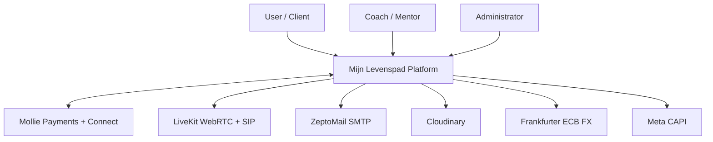

### Context narrative

Actors interact only through the web SPA. The platform owns business logic, persistence, and orchestration of payment/media/comms providers. Mollie is the **system of record for card/iDEAL checkout**; the platform DB is the **system of record for bookings, chat minutes, settlements, and coach bank details**.

---

## 3. Container diagram (C4 L2)

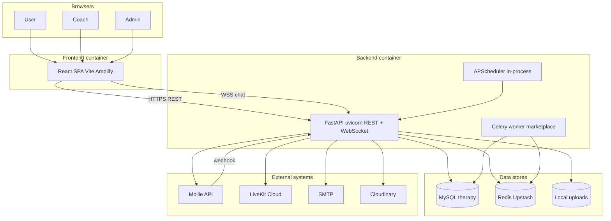

### Container responsibilities

| Container | Responsibility |
|-----------|----------------|
| **SPA** | UI, i18n, role dashboards, Mollie redirect return, optional `sync-mollie-payment` |
| **FastAPI** | Auth, domain APIs, webhooks, WS hub, PDF invoices, schema bootstrap |
| **MySQL** | Canonical transactional data |
| **Redis** | Celery broker; marketplace async; (optional result backend) |
| **Celery** | Outbox processing, webhook reconcile, marketplace jobs |
| **APScheduler** | In-process periodic tasks started in app lifespan |

---

## 4. Technology stack

### Frontend

| Layer | Choice |
|-------|--------|
| Framework | React 18 + TypeScript |
| Build | Vite |
| Routing | React Router |
| Data fetching | TanStack Query |
| UI | Tailwind + shadcn/Radix |
| Charts | Recharts (admin analytics) |
| Auth client | In-memory JWT + httpOnly refresh cookies |
| i18n | Custom `LanguageContext` + `appBase` / overrides |

### Backend

| Layer | Choice |
|-------|--------|
| Framework | FastAPI |
| ORM | SQLAlchemy |
| Validation | Pydantic v2 |
| Auth | JWT (HS256) access + refresh tokens in cookies |
| Rate limit | SlowAPI |
| PDF | ReportLab |
| Async jobs | Celery + Redis |
| In-process jobs | APScheduler |

### Infrastructure (typical)

| Concern | Typical deployment |
|---------|-------------------|
| SPA | AWS Amplify / static CDN (`mijnlevenspad.com`) |
| API | VPS/EC2 + nginx → uvicorn (intended host historically `innerfixintix.in`) |
| DB | MySQL (managed / RDS-compatible; current remote `therapy`) |
| Queue | Upstash Redis / local Redis |

---

## 5. Frontend architecture

### 5.1 Route map (by role)

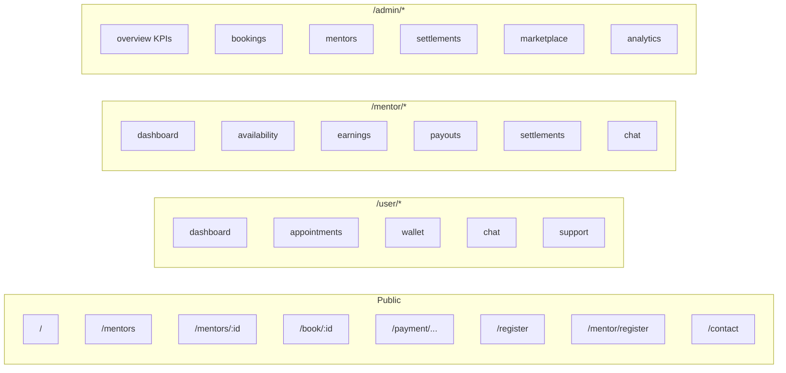

### 5.2 Frontend module layout

```
src/
  api/           # Typed REST clients (auth, bookings, payments, mentors, admin, chat…)
  auth/          # AuthContext — role-scoped access tokens + refresh
  components/    # Shared UI, dashboards layouts, admin filters
  pages/         # Route pages (public + user + mentor + admin)
  i18n/          # Copy & locale overrides
  lib/           # Timezone, Mollie pending helpers, errors
```

### 5.3 API client pattern

- `apiFetch` attaches `Authorization: Bearer <access>`
- Sends `credentials: 'include'` for refresh cookies
- On **401**, attempts role-specific refresh, then retries
- `VITE_API_URL` selects API origin (empty → same-origin / Vite proxy in local dev)

---

## 6. Backend architecture

### 6.1 Layering

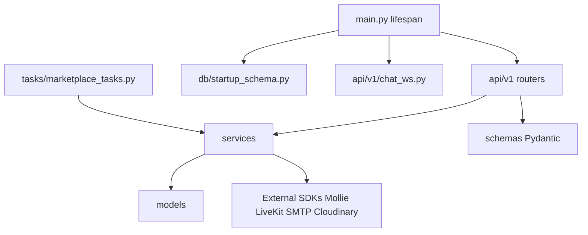

### 6.2 Router map (`/api/v1`)

| Router module | Domain |
|---------------|--------|
| `auth_user` / `auth_mentor` / `auth_admin` | Login, register, refresh, logout |
| `users_me` / `mentor_me` | Self profile |
| `mentors_public` | Directory, slots, chat availability |
| `bookings` (+ reschedule, calendar, waitlist) | Appointments |
| `payments` | Mollie intent, webhook, sync |
| `chat` + `chat_ws` | Metered chat REST + WebSocket |
| `meetings` | LiveKit token / meeting metadata |
| `marketplace` | Wallet ledger, Connect, coach payouts |
| `wallets` | User wallet |
| `invoices` / promo / favorites / notifications | Ancillary |
| `contact` | Public + authenticated support forms |
| `admin_router` | Full ops surface |
| `coach_applications` | Become-a-coach lead pipeline |
| `file_upload` | Images |

### 6.3 Startup bootstrap

On API boot (`main.py` lifespan), the app **idempotently ensures** schema pieces (ledger tables, presence, announcements, pricing, payout bank columns, availability windows, etc.). Steps soft-fail on transient MySQL disconnects so the API can still serve.

### 6.4 Service catalog (selected)

| Service | Role |
|---------|------|
| `payment_service` / `mollie_service` | Checkout + webhook processing |
| `booking_service` / `booking_slot_service` | Slot locking & booking lifecycle |
| `chat_service` / `chat_payment_service` | Sessions, minutes, purchases |
| `charges_service` | 70/30 fee math |
| `settlement_service` | Cycle aggregation for coach pay |
| `marketplace_service` / `ledger_service` | Double-entry-ish wallet accounts |
| `payout_gateway` | Mollie Connect payout adapter |
| `payout_bank_service` | IBAN/BIC validation |
| `wallet_service` | User wallet credit/debit |
| `meeting_service` / `livekit_*` | WebRTC rooms |
| `fx_checkout` | Multi-currency Mollie amounts |
| `support_inquiry_service` | Contact emails |

---

## 7. Data model overview

### 7.1 Core entity relationships

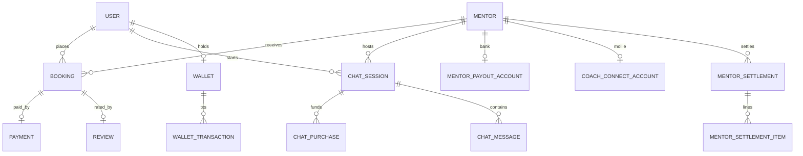

### 7.2 Table groups

| Group | Tables (representative) |
|-------|-------------------------|
| Identity | `users`, `mentors`, `admins`, `refresh_tokens`, `email_otp_codes` |
| Scheduling | `availability_slots`, `mentor_availability_windows`, `bookings`, `waitlist` |
| Payments | `payments`, `chat_purchases`, `promo_codes`, `platform_pricing` |
| Chat / media | `chat_sessions`, `chat_messages`, `chat_bridge_sessions` |
| Coach money | `mentor_payout_accounts`, `mentor_settlements`, `mentor_settlement_items`, `mentor_monthly_invoices`, `mentor_onboarding_payments` |
| Marketplace ledger | `wallet_accounts`, `ledger_transactions`, `ledger_entries`, `coach_payout_requests`, `coach_connect_accounts`, `outbox_events`, `webhook_event_logs` |
| Ops | `notifications`, `admin_announcements`, `coach_applications`, `mentor_presence_weeks`, `reviews` |

---

## 8. Authentication & security

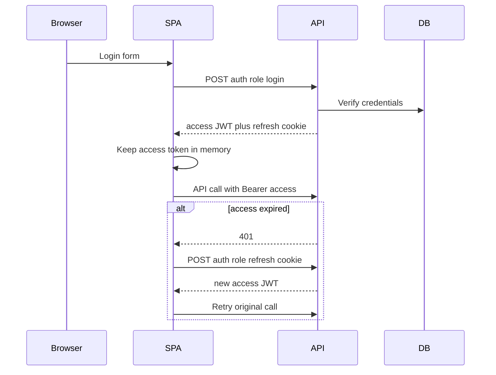

### Security properties

- **Three roles:** `user`, `mentor`, `admin` — separate cookie names
- **CORS** allow-list + regex for `*.mijnlevenspad.com`
- **Rate limiting** via SlowAPI
- **Webhook signature** verification when `MOLLIE_WEBHOOK_SECRET` set (fail-closed in production)
- **OTP email verification** for registration
- **Coach agreement** version snapshot at register

---

## 9. Core domain flows

### 9.1 Coach registration (incl. bank details)

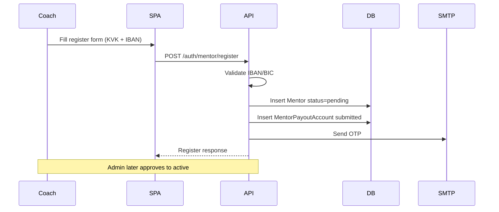

### 9.2 Booking + Mollie checkout

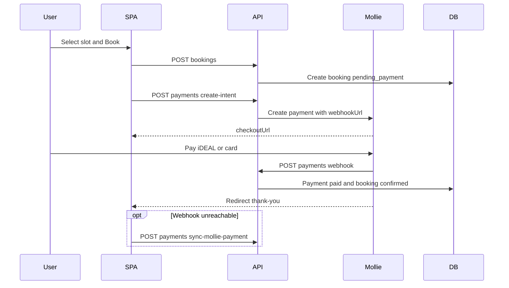

### 9.3 Metered chat session

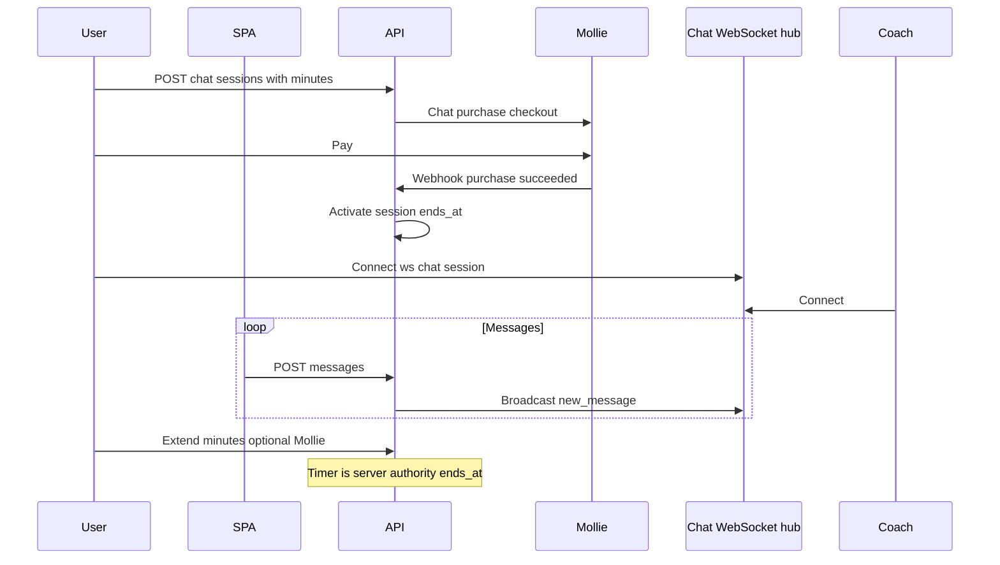

### 9.4 Coach settlement & payout

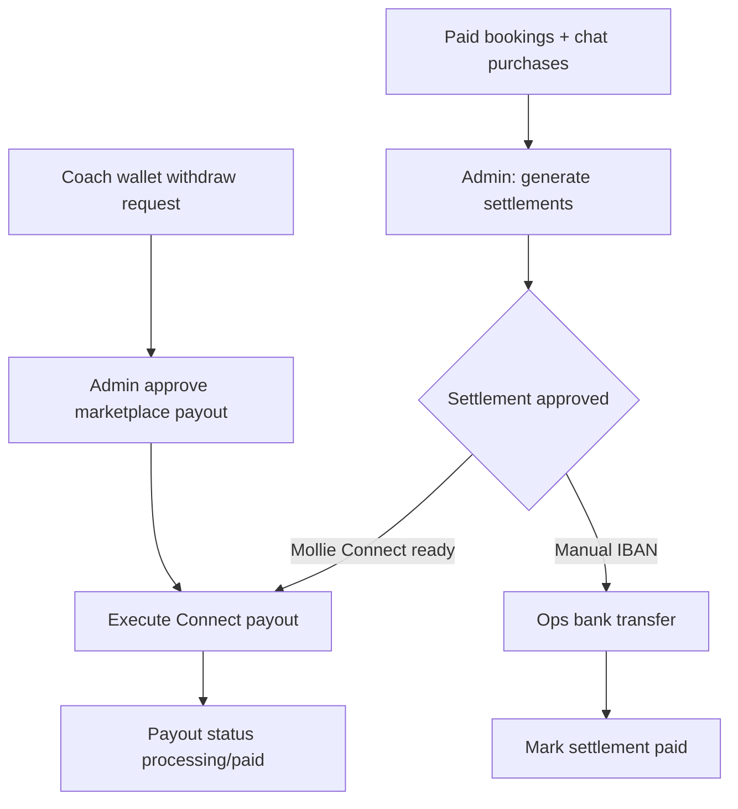

---

## 10. Payments & money architecture

### 10.1 Money in (user → platform)

| Product | Mechanism | DB artifact |
|---------|-----------|-------------|
| Session booking | Mollie payment | `payments` + `bookings.payment_status` |
| Chat minutes | Mollie payment | `chat_purchases` |
| Wallet top-up | Mollie | ledger / wallet credit |
| Coach onboarding fee | Mollie (optional; can be €0) | `mentor_onboarding_payments` |
| Coach monthly fee | Mollie invoice checkout | `mentor_monthly_invoices` |

### 10.2 Money out (platform → coach)

| Path | When to use | Mechanism |
|------|-------------|-----------|
| **Manual bank transfer** | Default / Connect incomplete | IBAN on `mentor_payout_accounts` |
| **Mollie Connect** | `payouts_enabled=true` | `payout_gateway` → connected account payout |
| **Marketplace withdraw** | Coach wallet balance | Request → admin approve → execute |

### 10.3 Fee model

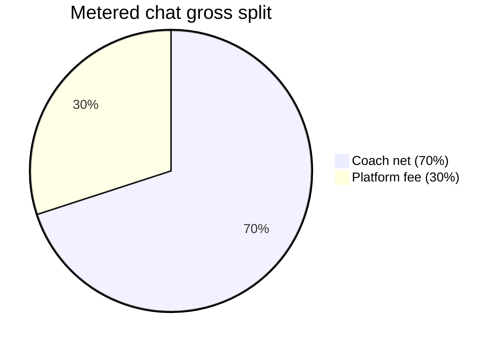

Session packages use `platform_pricing` tiers (5/10/20/30/60 minutes). Chat uses per-minute rate on mentor (`chat_price_per_minute`, default ~€0.90).

### 10.4 Critical config

| Env | Purpose |
|-----|---------|
| `MOLLIE_API_KEY` | Organization payments (`test_` vs `live_`) |
| `MOLLIE_WEBHOOK_BASE_URL` | Public **API** origin for webhooks |
| `MOLLIE_REDIRECT_BASE_URL` | Public **SPA** origin for return URLs |
| `MOLLIE_CONNECT_*` | OAuth Connect for coach payouts |
| `MARKETPLACE_*_PERCENT` | Commission / coach share defaults |

---

## 11. Realtime: chat, WebSocket, LiveKit

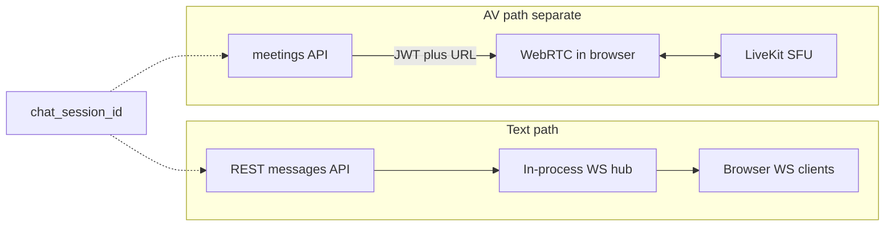

**Important production note:** nginx/ALB must upgrade `/api/v1/ws/` (see `backend/README.md`). Without it, browsers get WS `1006` and fall back to polling.

LiveKit SIP can optionally dial the peer’s phone into the room (`LIVEKIT_SIP_*`).

---

## 12. Admin & operations

### Admin console capabilities

- KPI overview + analytics (filters: coach, user, date range)
- Users / coaches CRUD-ish ops, approval, bank detail view
- Bookings, payments, reviews lists with filters
- Settlements generate / approve / pay / mark paid
- Marketplace commission + payout queue
- Wallet credit/debit ops
- Coach presence (weekly hours)
- Announcements (in-app + optional email)
- Coach applications CRM
- Invoice PDF downloads (booking, chat, monthly)

### Coach presence

Heartbeats from coach dashboard → weekly seconds online → admin compliance view (default target 20h/week).

---

## 13. Background jobs & async

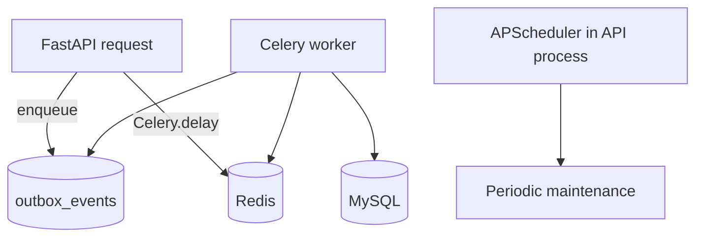

- **Celery app:** `backend/celery_app.py` · tasks in `tasks/marketplace_tasks.py`
- **Risk:** Upstash max record size can block enqueue (observed in local logs) — requires Redis hygiene + running worker

---

## 14. External integrations

| System | Direction | Used for |
|--------|-----------|----------|
| **Mollie** | Bi-directional | Checkout, webhooks, Connect OAuth, payouts |
| **LiveKit** | Outbound | Room JWT, optional SIP |
| **ZeptoMail SMTP** | Outbound | OTP, support, announcements |
| **Cloudinary** | Outbound | Image CDN (else local `/uploads`) |
| **Frankfurter** | Outbound | FX for non-EUR checkout |
| **Meta CAPI** | Outbound | Optional analytics events |
| **Google Sign-In** | Frontend optional | `VITE_GOOGLE_CLIENT_ID` |

---

## 15. Deployment topology

### Target (healthy production)

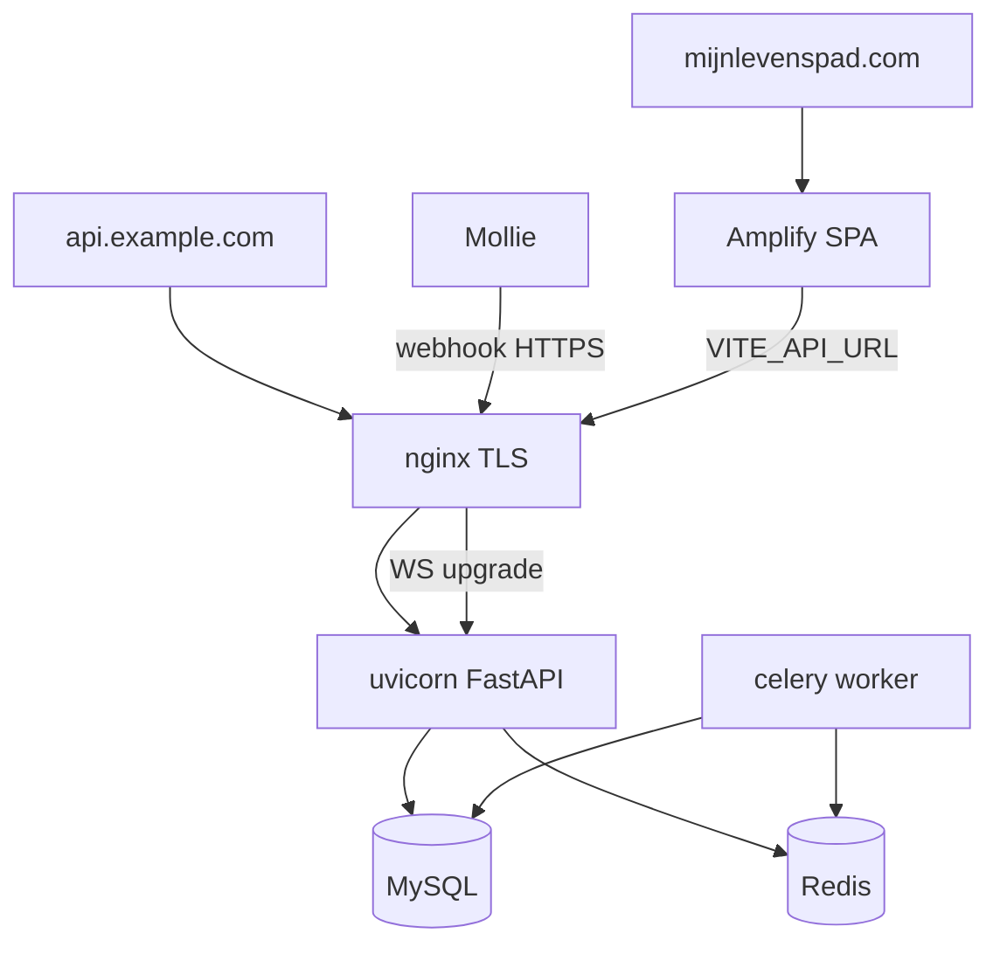

### Current observed gaps (ops checklist)

| Item | Status / risk |
|------|----------------|
| SPA hosts | `mijnlevenspad.com` / Amplify up (static) — **no `/api` proxy** |
| Configured API host `innerfixintix.in` | DNS **NXDOMAIN** → webhooks/redirects broken if used |
| Local API | Often `localhost:8001` against remote DB |
| Mollie key mode | Live key possible on development machine — high risk |
| Celery/Redis | Outbox enqueue failures possible when Redis oversized |

---

## 16. Known gaps & recommendations

1. **Establish a stable public API hostname** (DNS + TLS + nginx) and set `MOLLIE_WEBHOOK_BASE_URL` to it.
2. Set SPA `VITE_API_URL` to that API host; keep `MOLLIE_REDIRECT_BASE_URL` on the SPA origin.
3. Use **test_** Mollie keys for local/dev; **live_** only on production API.
4. Run Celery worker continuously; monitor Redis size / flush stuck keys.
5. Complete IBAN collection for all active coaches; finish Mollie Connect KYC where auto-payouts are desired.
6. Prefer horizontal scale carefully: **in-process WS hub is single-instance** — multi-node needs Redis pub/sub or sticky sessions + shared bus.
7. Document nginx WS upgrade as a release gate for chat.

---

## 17. Appendix — API surface map

```
/health
/api/v1/auth/user|mentor|admin/...
/api/v1/users/me
/api/v1/mentors/...          (public directory)
/api/v1/mentors/me/...       (coach self)
/api/v1/bookings/...
/api/v1/payments/...         (intent, webhook, sync, currencies)
/api/v1/chat/...             (sessions, messages, invoices)
/api/v1/ws/chat/{session_id} (WebSocket)
/api/v1/meetings/...
/api/v1/marketplace/...      (wallet, connect, payouts)
/api/v1/wallets/...
/api/v1/admin/...            (ops)
/api/v1/contact/...
/uploads/...                 (static fallback media)
```

### Repository layout

```
inner-path-design-main/
  src/                 # React SPA
  backend/
    main.py            # FastAPI entry
    api/v1/            # Routers
    services/          # Domain logic
    models/            # SQLAlchemy
    schemas/           # Pydantic
    tasks/             # Celery
    db/                # Session + startup schema
    migrations/        # SQL migrations
  docs/
    TECHNICAL_ARCHITECTURE.md   # this file
    technical-architecture.html # print-to-PDF companion
```

---

## Document control

| Field | Value |
|-------|-------|
| Source of truth | Application repository |
| Diagram format | Mermaid (render in GitHub, VS Code, or the HTML companion) |
| PDF export | Open `docs/technical-architecture.html` → Print → Save as PDF |

*End of technical architecture document.*
